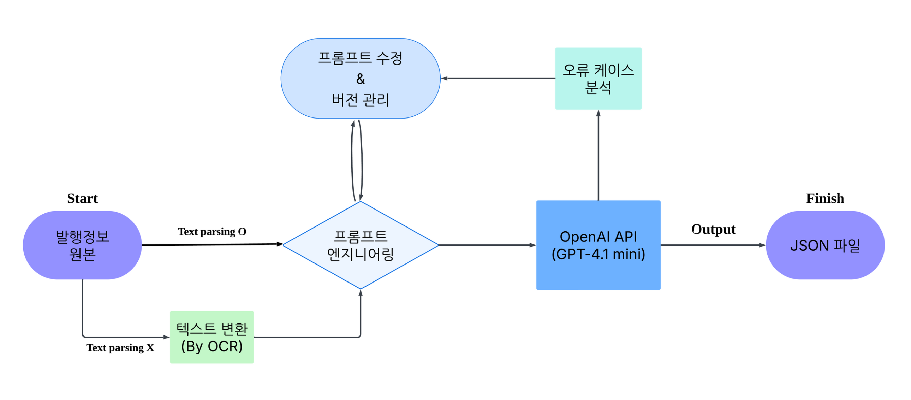

# termsheet2json

텀시트를 OCR과 LLM으로 읽어 **구조화된 JSON**으로 변환하는 파이프라인입니다.

서울대 KDT 10기 캡스톤 프로젝트 (2025.03 ~ 2025.07, 3인 팀)

## 아키텍처



원본에서 텍스트가 바로 파싱되면 그대로 쓰고, 스캔본이면 OCR로 텍스트를 만듭니다. 그 텍스트를
상품별 프롬프트와 함께 LLM에 넘겨 JSON을 받습니다. 오류 케이스를 모아 프롬프트를 고치고
버전으로 남기는 반복이 정확도를 끌어올린 축이었습니다.

추출 결과에는 `field_mappings`가 함께 나옵니다. 각 필드가 원문 어느 위치에서 나왔는지를
담고 있어서, 검수자가 값을 원문과 대조할 수 있습니다. OCR이 문자 좌표를 주기 때문에
가능한 구조입니다.

## 프로젝트 설명

금융 파생상품 텀시트(PDF·DOCX)에서 발행정보를 뽑아 DB에 넣는 일은 사람이 문서를 한 장씩
읽고 수십 개 필드를 옮겨 적는 작업이었습니다. **건당 약 6분**이 걸렸고, 수기 입력이라
오류가 섞일 여지도 있었습니다. 이 과정을 자동화하는 것이 목표였습니다.

지원 상품은 세 가지입니다.

| 상품 | 추출 항목 |
|---|---|
| 채권선도 (Bond Forward) | 기초자산, 선도가격, 정산방식, 만기정산금액, 효력발생일 등 |
| FRN (변동금리채권) | 가산금리, 이자계산·지급주기, 결정LAG, 승수, Cap·Floor 등 25개 필드 |
| IRS (금리스왑) | 고정·변동 레그 조건, 원금교환·Amortization 구조, RFR 관찰방법 등 |

문서마다 형식이 제각각입니다. 발행기업·문서양식·상품 특성에 따라 구성이 천차만별이고,
스캔본은 표가 뭉개진 채로 들어옵니다. 또 텀시트에 직접 적혀 있지 않아 **추론해서 채워야
하는 항목**도 있어, 규칙 기반 파싱만으로는 풀리지 않았습니다.

그래서 두 단계로 나눴습니다. **OCR로 문자와 좌표를 확보해 표 구조를 행 단위로 복원하고**,
그 텍스트를 상품별 프롬프트와 함께 LLM에 넘겨 필드를 뽑습니다.

추출값은 그대로 쓰지 않고 사람이 검수합니다. 발행정보 DB에 들어갈 값이라 틀리면 안 되기
때문입니다. 검수 화면에서 값을 고르면 원문의 해당 위치가 하이라이트되고, 이걸 가능하게
하는 것이 위의 `field_mappings`입니다.

## 저장소 구성

| 디렉터리 | 내용 |
|---|---|
| [`web/`](web/) | 웹 애플리케이션 (React + FastAPI). 업로드 → OCR → JSON 변환 → 검수 → 다운로드 |
| [`prompt-optimizer/`](prompt-optimizer/) | 정답 CSV와 비교해 프롬프트를 LLM으로 자동 개선하는 반복 최적화 도구 |
| [`experiments/`](experiments/) | 연구 과정 기록. OCR 엔진 비교, 후처리 규칙 도출, 추출 정확도 분석 |
| [`docs/`](docs/) | 아키텍처 다이어그램과 생성 프롬프트 |
| [`data/samples/`](data/samples/) | 합성 샘플 데이터 |

## 결과

필드 단위로 정답 DB 테이블과 대조해 측정했습니다. OOS는 학습·튜닝에 쓰지 않은 별도 문서입니다.

| 상품 | 데이터셋 | 정확도 | OOS | OOS 정확도 |
|---|---|---|---|---|
| 채권선도 | 300건 | **98.76%** | 150건 | **99.15%** |
| FRN | 74건 | **97.42%** | 37건 | **98.42%** |
| IRS | 66건 | **95.40%** | — | — |

처리 시간은 **건당 약 6분에서 약 30초로** 줄었습니다.

남은 오차는 특정 필드에 몰려 있습니다. 채권선도는 선도가격(96%)과 BDC(94.33%), FRN은
가산금리(62.16% → 프롬프트 개선 후 81.08%)가 약했습니다. 숫자 표기와 OCR 오인식이
겹치는 필드들입니다.

사람과 LLM은 오류의 성격이 다릅니다. 사람은 오류가 드물지만 무작위로 발생해 추적이
어렵고, LLM은 더 자주 틀리지만 **틀리는 방식이 패턴화되어** 프롬프트로 교정할 수 있었습니다.

## 기술 선택

### OCR 엔진

Tesseract · PaddleOCR · EasyOCR을 같은 텀시트로 비교했습니다
([`experiments/ocr/`](experiments/ocr/)).

| 엔진 | 결과 |
|---|---|
| PaddleOCR | 실행 20분, 탐지·인지 모두 부정확 |
| Tesseract | 탐지·인지 부정확 |
| **EasyOCR** | 탐지 성능 우수. **문자 단위 좌표 제공** → 채택 |

좌표를 주는지가 갈랐습니다. 표 구조를 행 단위로 복원하는 근거이자, `field_mappings`의 근거이기도 합니다.

**표 처리**는 두 번 고쳤습니다. 처음에는 일정 거리 기준으로 행을 나눠 위에서부터 순차
출력했는데, 키 값이 셀 중앙에 있으면 무너졌습니다. 선 인식으로 셀 좌표를 파싱해
`(0,0) (0,1) (1,0) (1,1)` 순으로 정렬하는 방식으로 바꿨습니다. 스캔 문서는 기울어져 있어
수직선 감지가 자주 실패했고, 기울기 보정을 넣어 해결했습니다.

### LLM

비용 때문에 오픈소스 모델로 시작했지만, 실행 시간에서 갈렸습니다. (입력 37,353 토큰 기준)

| 환경 | 모델 | 소요 시간 |
|---|---|---|
| 로컬 MacBook M3 Air | Llama-7B-chat | 4시간 이상 |
| Google Colab T4 | Llama-7B-chat | 약 23분 |
| **OpenAI API** | GPT-3.5-turbo | **약 2분** |

이후 API 모델 안에서 비교해 **GPT-4.1-mini**로 확정했습니다.

### 프롬프트 엔지니어링

Role Prompting · Few-shot · Chain-of-Thought를 함께 썼습니다. **프롬프트를 한국어에서
영어로 옮긴 것**이 특히 효과가 컸습니다. 같은 채권선도 300건, 시드 42 고정 기준입니다.

| | 한국어 초기 + GPT-4o-mini | 영어 최종 + GPT-4.1-mini |
|---|---|---|
| 정확도 1.0 파일 | 234건 | **263건** |
| 기초자산 | 98.33% | **100%** |
| 정산방식 | 96% | **100%** |
| 선도가격 | 88.67% | **96%** |

CoT는 OCR 오인식을 프롬프트 단계에서 되돌리는 데 썼습니다. 예를 들어 `연 1.4496틀 가산한`
이라는 텍스트에서 끝의 `96`이 `%`의 오인식임을 추론하게 하고, `가산금리`를 `0.0144`로
출력하도록 유도했습니다.

## 빠르게 실행하기

웹 앱이 완성된 결과물입니다.

```bash
cd web
cp .env.example .env          # OPENAI_API_KEY 를 채운다

python -m venv venv && source venv/bin/activate
pip install -r requirements.txt
npm install

npm start                     # 백엔드(8000) + 프론트엔드(3000) 동시 실행
```

자세한 내용은 [`web/README.md`](web/README.md)를 보세요.

## 데이터에 관하여

이 저장소에는 **실제 텀시트나 고객 정보가 들어 있지 않습니다.** 원본 계약서, OCR 산출물,
추출 결과는 모두 `.gitignore`로 제외했고, 노트북 출력 셀도 비워 두었습니다.
파이프라인을 확인하려면 [`data/samples/`](data/samples/)의 합성 데이터를 쓰세요.

그래서 `experiments/`의 노트북은 그대로 실행되지 않습니다. 입력 경로를 자신의 데이터 위치로
바꿔야 합니다. 각 노트북 상단의 경로 상수를 보세요.

## 기술 스택

- **OCR**: EasyOCR (좌표 기반 표 정렬), PaddleOCR·Tesseract는 비교 실험용
- **LLM**: OpenAI GPT-4.1-mini (상품별 프롬프트 YAML, 버전 관리)
- **백엔드**: FastAPI, WebSocket (페이지 단위 실시간 진행률)
- **프론트엔드**: React 19, PDF.js
