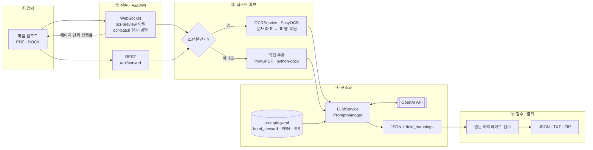

# termsheet2json

텀시트를 OCR과 LLM으로 읽어 **구조화된 JSON**으로 변환하는 파이프라인입니다.

## 아키텍처



추출 결과에 `field_mappings`가 함께 나옵니다. 각 필드가 원문 어느 위치에서 나왔는지를
담고 있어서, 검수자가 값을 원문과 대조할 수 있습니다. OCR이 문자 좌표를 주기 때문에
가능한 구조입니다.

## 프로젝트 설명

금융 파생상품 텀시트(PDF·DOCX)에서 발행정보를 뽑아 DB에 넣는 일은 사람이 문서를 한 장씩
읽고 수십 개 필드를 옮겨 적는 작업이었습니다. 이 과정을 자동화하는 것이 목표였습니다.

지원 상품은 세 가지입니다.

| 상품 | 설명 |
|---|---|
| 채권선도 (Bond Forward) | 장외파생 거래확인서에서 기초자산·선도가격·결제방식 등을 추출 |
| FRN (변동금리채권) | 가산금리·이자계산주기·DCC 등 25개 필드 추출 |
| IRS (금리스왑) | 고정·변동 레그 조건 추출 |

문서마다 형식이 제각각이고, 스캔본은 표가 뭉개진 채로 들어옵니다. 그래서 두 단계로 나눴습니다.
**OCR로 문자와 좌표를 확보해 표 구조를 행 단위로 복원하고**, 그 텍스트를 상품별 프롬프트와
함께 LLM에 넘겨 필드를 뽑습니다.

추출값은 그대로 쓰지 않고 사람이 검수합니다. 발행정보 DB에 들어갈 값이라 틀리면 안 되기
때문입니다. 검수 화면에서 값을 고르면 원문의 해당 위치가 하이라이트되고, 이걸 가능하게 하는
것이 위의 `field_mappings`입니다.

## 빠르게 실행하기

웹 앱이 완성된 결과물입니다.

```bash
cd web
cp .env.example .env          # OPENAI_API_KEY 를 채운다

python -m venv venv && source venv/bin/activate
pip install -r requirements.txt
npm install

npm start                     # 백엔드(8000) + 프론트엔드(3000) 동시 실행
```

자세한 내용은 [`web/README.md`](web/README.md)를 보세요.

## 데이터에 관하여

이 저장소에는 **실제 텀시트나 고객 정보가 들어 있지 않습니다.** 원본 계약서, OCR 산출물,
추출 결과는 모두 `.gitignore`로 제외했고, 노트북 출력 셀도 비워 두었습니다.
파이프라인을 확인하려면 [`data/samples/`](data/samples/)의 합성 데이터를 쓰세요.

그래서 `experiments/`의 노트북은 그대로 실행되지 않습니다. 입력 경로를 자신의 데이터 위치로
바꿔야 합니다. 각 노트북 상단의 경로 상수를 보세요.

## 기술 스택

- **OCR**: EasyOCR (좌표 기반 표 정렬), PaddleOCR·Tesseract는 비교 실험용
- **LLM**: OpenAI GPT (상품별 프롬프트 YAML, 버전 관리)
- **백엔드**: FastAPI, WebSocket (페이지 단위 실시간 진행률)
- **프론트엔드**: React 19, PDF.js

## 저장소 구성

| 디렉터리 | 내용 |
|---|---|
| [`web/`](web/) | 웹 애플리케이션 (React + FastAPI). 업로드 → OCR → JSON 변환 → 검수 → 다운로드 |
| [`prompt-optimizer/`](prompt-optimizer/) | 정답 CSV와 비교해 프롬프트를 LLM으로 자동 개선하는 반복 최적화 도구 |
| [`experiments/`](experiments/) | 연구 과정 기록. OCR 엔진 비교, 후처리 규칙 도출, 추출 정확도 분석 |
| [`docs/`](docs/) | 아키텍처 다이어그램 생성 프롬프트 |
| [`data/samples/`](data/samples/) | 합성 샘플 데이터 |
